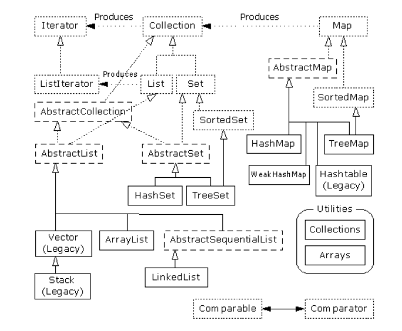

###对象的容纳
> 程序设计过程中，为了方便容纳和操作对象， JAVA提供了多种方式。
####数组
1. 数组是JAVA内建的类型，作为容纳对象的一种方式。
2. 数组是相同类型元素的集合，内存中分配一块连续的内存区域，通过数组下标索引计算出元素对应内存区域的存储地址。
3. 数组可以高效的访问元素，但是数组的创建时就必须指定数组的大小。
###集合类
> 集合类是一系列实现抽象数据结构的类集合，这些类为容纳和操作对象提供了不同形式的实现。
####常见数据结构
>数据结构是计算机存储、组织数据的方式。数据结构是指相互之间存在一种或多种特定关系的数据元素的集合

1. 集合: 
	数据结构中的元素之间除了“同属一个集合” 的相互关系外，别无其他关系；
2. 线性结构
	数据结构中的元素存在一对一的相互关系；
3. 树形结构
	数据结构中的元素存在一对多的相互关系；
4. 图形结构
	数据结构中的元素存在多对多的相互关系。

参考：
[百度百科-数据结构](https://baike.baidu.com/item/%E6%95%B0%E6%8D%AE%E7%BB%93%E6%9E%84/1450#5 "百度百科-数据结构")
###Java 1.2之前集合类
>java 1.2版本之前，只提供了几种有限的集合类的实现：`Vector`(矢量)、`BitSet`(位集)、`Stack`(堆栈)、`Hashtable`(散列表).

1. `Vector`(矢量)：自增长的对象数组的实现。 内部使用数组存储对象，当容量大于数组长度时，创建一个大于原数组大小的新数组，将原数组数据复制到新数组，再将新数组赋值给原数组。
2. `BitSet`(位集)：自增长的位向量实现。内部使用long数组存储各个位向量值（0,1）,通过逻辑与(`&`)，逻辑或(`|`)，逻辑非(`~`)来操纵位向量的值。
3. `Stack`(堆栈)： 一种“后入先出”（LIFO）集合。继承`Vector`封装`push`,`pop`，`peek`操作。
4. `Hashtable`(散列表): 哈希表数据结构的实现（哈希表:根据关键码值(Key value)而直接进行访问的数据结构。也就是说，它通过把关键码值映射到表中一个位置来访问记录，以加快查找的速度参考：[百度百科-哈希表](https://baike.baidu.com/item/%E5%93%88%E5%B8%8C%E8%A1%A8/5981869?fr=aladdin "百度百科-哈希表")）。内部通过数组链表来存储对象，通过对象的哈希值来映射数组下标来查找和存储对象。如果映射的数组下标已存在对象（冲突），则把对象链接到此下标对应的链表头部，如果冲突超过阀值，则进行扩容数组链表大小和复制原有对象到新数组链表（`rehash`操作）。
###Java 1.2集合类
>由于Java 1.2之前有限的集合类和混乱的设计，Java 1.2对集合进行了完全的重新设计。 并将这些集合类归集成java.util库的一部分。新的集合库考虑了“容纳自己对象”的问题，并将其分割成两个并且概念。

1. 集合（Collection）：一组单独的元素，通常应用了某种规则。 在这里，一个 List（列表）必须按特定
的顺序容纳元素，而一个Set（集）不可包含任何重复的元素。相反，“包”（Bag）的概念未在新的集合库
中实现，因为“列表”已提供了类似的功能。
2. 映射（Map）：一系列“键－值”对（这已在散列表身上得到了充分的体现）。 简单地在一
个Map 里包含其他Map（后者又可以包含更多的Map，以此类推）。

新的集合类示意图：

####示意图说明
1. 虚线框代表“接口”。
2. 点线框代表“抽象”类。
3. 实线框代表普通（实际）类。
4. 点线箭头表示一个特定的类准备实现一个接口（在抽象类的情况下，则是“部分”实现一个接口）。
5. 双线箭头表示一个类可生成箭头指向的那个类的对象。例如，任何集合都可以生成一个反复器（Iterator），而一个列表可以生成一个
ListIterator（以及原始的反复器，因为列表是从集合继承的）。
####框架分析
1. 接口(Collection(List,Set),Map)： 提供集合类的通用行为。如Collection定义了集合类操作最基础的行为：添加，删除，迭代对象等操作，以达到最大通用性。Map定义键映射值的最基本行为。 List（有序对象集合）, Set（无重复对象集合）扩展Collection接口，定义自己的独有规则操作对象的行为。 
2. 抽象类(AbstractCollection(AbstractList,AbstractSet),AbstractMap)：提供基本接口的骨干实现，最小化实现子类的共有行为。 便于以此类为基础定制特有规则的集合类，一般无需关注此类，除非需要自定义集合类。
3. 实现类：继承抽象类，实现特有规则的集合类，如:ArrayList, LinkedList, HashMap, TreeMap等。
4. 遗留类(Vector,Stack)：Vector, Stack为Java 1.2之前版本实现的集合类，已经可以用现有的类来替代这些类的来使用。如ArrayList替换Vector,Deque(java 1.2版本未实现)替换Stack。保留这些类是为了兼容已有代码。
5. 迭代器（反复器）(Iterator,ListIterator)： 迭代容器元素是一种通用高频的行为，迭代器（反复器）定义了访问这些元素的通用行为。 通过上溯造型成迭代器接口就具备了迭代所有集合类的方法，因为此迭代器在所有实现类中都进行了实现（多形性）。
6. 比较器(Comparable,Comparator): 排序容纳元素是一种通用高频行为，但是各个对象的比较规则又是各不相同。将这些对象易于变化的部分分离出来是设计此类的理念所在。Comparable定义对象的比较行为，集合类中使用Comparable以此屏蔽对象的具体比较规则（类的多形性特性）。
7. 工具类（Collections, Arrays）: 提供操作集合和数组的便利方法，以及集合之间的转换等方法。
####集合类实现类简要分析